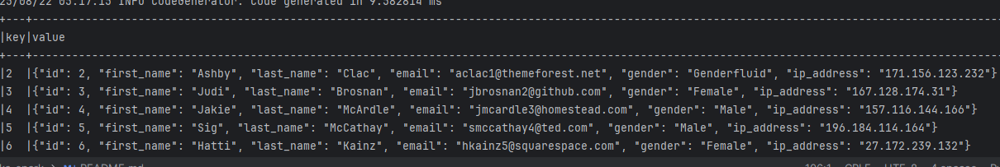

# Pyspark and Kafka Integration

 + Apache Kafka


## Overview
This project demonstrates how to connect **Pyspark** with **Kafka** to perform data stream processing and analysis data stored in **postgres** table.

## Prerequisites

Before you begin, ensure you have the following installed:
- [Docker](https://www.docker.com/get-started)
- [Dbeaver](https://dbeaver.io/download/)

To this project using kafka jars dependencies using 4.0.0 version and kafka client 3.9.0 version 

If you need to work with other scala version checking in https://mvnrepository.com/artifact/org.apache.spark/spark-sql-kafka-0-10
and download the Jar in this repository https://repo1.maven.org/maven2/org/apache/spark/

## Steps
We have a custom docker images that contains kafka jars dependencies installed

### Run the docker-compose
```console
docker-compose up
```

### Load data in postgres
 
Connect to postgres using dbeaver with properties
``` bash
'host' : 'localhost',
'dbname' : 'postgres',
'user' : 'postgres',
'password' : "postgres",
'port' : '5433'
```
and run the following queries:
```sql
create TABLE public.tickets(
id int,
first_name varchar(20),
last_name varchar(20),
email varchar(50),
gender varchar(20),
ip_address varchar(20)
);


COPY public.tickets
FROM '/data/MOCK_DATA.csv'
DELIMITER ','
CSV HEADER;
```

### Check is the data load successfully 

```sql
select * from public.tickets
```


### Create the kafka topic to store stream data

```sh
docker exec --workdir /opt/kafka/bin/ -it broker sh ./kafka-topics.sh --bootstrap-server localhost:9092 --create --topic topic-1
```

### Push the stream data to topic

Run the python script that read postgres table and push the rows to kafka topic 
```sh
python ./read_postgres.py
```

### Check the network created with docker-compose 
Identify the name of network created with docker-compose because we use this network for run pyspark script
```shell
docker network ls
```


In my case the network named kafka_spark_kafka-spark-network

### Execute the docker run

To make the connection we need to send the follow params: 
* -v (create volume) to send folder path with pyspark script

Need send absolute path folder

```console
docker run --rm --network <network name> \
-v ${pwd}/spark/scripts:/scripts \
rsantos1089/spark:scala-2.13 \
spark-submit /scripts/read_kafka_topic.py
```

or type the follow command

```console
docker exec -u root -it spark-master \
spark-submit --conf spark.jars.ivy=/opt/bitnami/spark/tmp/.ivy2 \
/opt/bitnami/external_scripts/read_kafka_topic.py
```

We can see the data 

